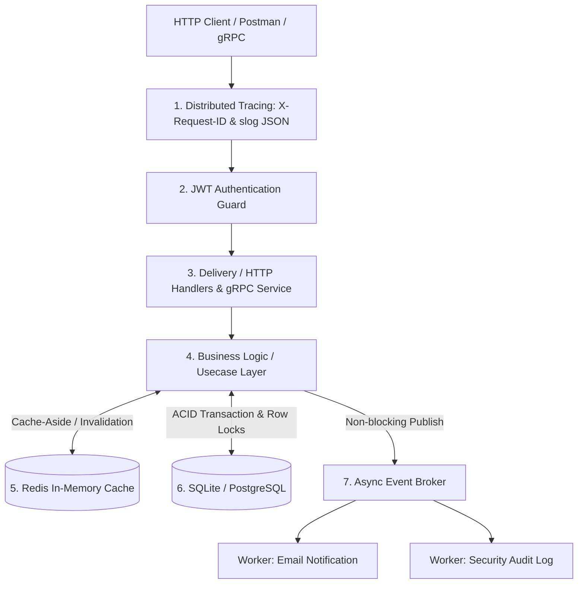

# 🚀 Enterprise Golang Backend Engineering Blueprint

Repository ini berisi blueprint arsitektur dan kurikulum komprehensif pembelajaran **Golang Backend Engineering** tingkat lanjut (*Production-Ready*), dirancang sesuai standar tech company, unicorn, dan industri fintech (berdasarkan mapping lowongan kerja di JobStreet & LinkedIn).

---

## 🗺️ Peta Arsitektur & Modul Sistem



---

## 🛠️ Ringkasan Modul & Fitur

### 1. ⚙️ Fundamental & Concurrency
- Structs, Pointers, Interfaces, Custom Errors.
- Concurrency: `sync.Mutex`, `sync.WaitGroup`, *Worker Pool Pattern*, `context.Context` Timeout & Cancellation.
- 📂 Folder: [`basic/`](./basic/) & [`concurrency/`](./concurrency/)

### 2. 🏛️ Clean Architecture & Security
- 4 Lapisan Modular: **Domain**, **Repository**, **Usecase**, **Delivery (HTTP Handlers)**.
- **JWT Authentication** (Bearer Token) & **Bcrypt Password Hashing**.
- 📂 Folder: [`domain/`](./domain/), [`repository/`](./repository/), [`usecase/`](./usecase/), [`delivery/`](./delivery/)

### 3. ⚡ High-Performance Redis Caching
- **Cache-Aside Pattern**: Mengurangi latency query database hingga < 1ms.
- **Auto Cache Invalidation**: Menghindari data basi (*stale data*) saat Create/Delete.
- **Graceful Fallback**: API tetap beroperasi normal jika Redis offline.
- 📂 File: [`utils/redis.go`](./utils/redis.go), [`usecase/product_usecase.go`](./usecase/product_usecase.go)

### 4. 📨 Event-Driven Architecture (EDA) & Background Workers
- **Event Broker**: Dispatcher in-memory berbasis Goroutines & Channels.
- **Decoupled Workers**: Pengiriman welcome email dan pencatatan audit log di background tanpa membebani response HTTP user.
- 📂 Folder: [`events/`](./events/)

### 5. 💳 Fintech ACID Database Transactions & Row Locking
- **Atomic Balance Transfer**: Mencegah saldo hilang jika server crash di tengah transfer.
- **Pessimistic Row Locking (`SELECT FOR UPDATE`)**: Mengunci data baris rekening untuk mencegah *Double Spending* & *Race Condition*.
- 📂 File: [`domain/wallet.go`](./domain/wallet.go), [`usecase/wallet_usecase.go`](./usecase/wallet_usecase.go)

### 6. 📊 Observability & Structured Logging (`log/slog`)
- Log terstruktur format **JSON** standar Go `log/slog` (kompatibel Datadog/Loki).
- **Request ID Middleware**: Injeksi header `X-Request-ID` untuk pelacakan alur (*distributed tracing*).
- 📂 File: [`utils/logger.go`](./utils/logger.go), [`delivery/http/middleware.go`](./delivery/http/middleware.go)

### 7. 🧪 Unit Testing & Mocking (Testify)
- 100% decoupled unit testing untuk Usecase dengan `testify/mock`.
- Mencapai **80%+ code coverage**.
- 📂 File: [`usecase/product_usecase_test.go`](./usecase/product_usecase_test.go), [`usecase/auth_usecase_test.go`](./usecase/auth_usecase_test.go)

### 8. ⚡ Microservices gRPC & Protocol Buffers
- Skema Protobuf v3 (`product.proto`).
- **Unary RPC** & **Server Streaming RPC** via HTTP/2 binary protocol.
- 📂 Folder: [`grpc/`](./grpc/)

### 9. 🐳 Containerization (Docker Multi-Stage Build)
- Multi-stage build Go yang sangat ringan (**< 20MB**).
- Orkestrasi API & Redis via `docker-compose.yml`.
- 📂 File: [`Dockerfile`](./Dockerfile), [`docker-compose.yml`](./docker-compose.yml)

---

## 🚀 Panduan Menjalankan

### 1. Menjalankan REST API Server:
```bash
go run cmd/api/main.go
```
*Buka file [`request.http`](./request.http) untuk mencoba langsung seluruh endpoint (Auth, Products, Wallets, Transfer).*

### 2. Menjalankan Unit Tests:
```bash
go test -v -cover ./usecase/...
```

### 3. Menjalankan gRPC Server & Client:
```bash
# Terminal 1
go run grpc/server/main.go

# Terminal 2
go run grpc/client/main.go
```

### 4. Menjalankan via Docker Compose:
```bash
docker-compose up --build
```
