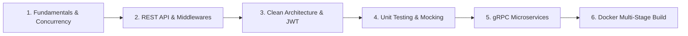

# 🚀 Golang Backend Learning & Production Blueprint

Repository ini berisi kurikulum komprehensif pembelajaran **Golang Backend Engineering** yang disesuaikan dengan kebutuhan riil industri tech company, fintech, dan startup unicorn (berdasarkan mapping lowongan kerja di JobStreet & LinkedIn).

---

## 🗺️ Roadmap & Modul Pembelajaran



### 1. ⚙️ Fundamental & Concurrency
- **Structs, Pointers & Methods**: Memory management dan mutasi data aman.
- **Interfaces & Polymorphism**: Desain decoupled code yang mudah diuji.
- **Error Handling**: Idiomatik `if err != nil` dengan custom domain errors.
- **Concurrency Master**:
  - `sync.Mutex` untuk mencegah *Race Condition*.
  - `sync.WaitGroup` untuk sinkronisasi goroutines paralel.
  - *Worker Pool Pattern* dengan Channels dan Buffered Channels.
  - `context.Context` untuk *Timeout & Cancellation* otomatis.

📂 Folder: [`basic/`](./basic/) & [`concurrency/`](./concurrency/)

---

### 2. 🌐 REST API (Gin Framework)
- HTTP Routing, Grouping, dan Versioning (`/api/v1`).
- Struct Tag Validation (`binding:"required,min=3,gt=0"`).
- Custom Middlewares (Request Latency Logger & Timer).
- Standardized API Response format (`success`, `data`, `error`).

📂 Folder: [`rest-api/`](./rest-api/)

---

### 3. 🏛️ Enterprise Clean Architecture
Pemisahan kode menjadi lapisan independen:
- **`domain/`**: Entitas bisnis dan DTO (Data Transfer Objects).
- **`repository/`**: Layer akses data dengan database SQLite via **GORM**.
- **`usecase/`**: Logika bisnis terpusat.
- **`delivery/http/`**: Controller Gin dan **JWT Authentication Guard Middleware**.
- **`utils/`**: Bcrypt password hashing & JWT token generator/validator.

📂 Folder: [`domain/`](./domain/), [`repository/`](./repository/), [`usecase/`](./usecase/), [`delivery/`](./delivery/)

---

### 4. 🧪 Unit Testing & Mocking (Testify)
- 100% decoupling testing pada layer `Usecase`.
- Mock repository dengan `github.com/stretchr/testify/mock`.
- Assertions dan validasi skenario positif (*success*) dan skenario negatif (*error / not found*).
- Mencapai **80% statement coverage**.

📂 Test Files: [`usecase/product_usecase_test.go`](./usecase/product_usecase_test.go), [`usecase/auth_usecase_test.go`](./usecase/auth_usecase_test.go)

---

### 5. ⚡ gRPC & Protocol Buffers (Microservices)
- Kontrak Protobuf v3 (`product.proto`).
- **Unary RPC**: Pembuatan dan pengambilan produk via protokol biner HTTP/2.
- **Server Streaming RPC**: Pengiriman stream data produk secara berurutan (*real-time*).
- Kompilasi otomatis dengan `protoc` + `protoc-gen-go` & `protoc-gen-go-grpc`.

📂 Folder: [`grpc/`](./grpc/)

---

### 6. 🐳 Containerization (Docker Multi-Stage Build)
- Multi-stage build menggunakan `golang:alpine` sebagai builder dan `alpine:3.19` sebagai runner.
- Menghasilkan production image yang sangat ringan (**< 20 MB**).
- Orkestrasi dengan `docker-compose.yml`.

---

## 🛠️ Quick Start

### Menjalankan REST API:
```bash
go run cmd/api/main.go
```
*Gunakan file [`request.http`](./request.http) untuk mencoba langsung semua endpoint via REST Client.*

### Menjalankan Unit Tests:
```bash
go test -v -cover ./usecase/...
```

### Menjalankan gRPC Server & Client:
```bash
# Terminal 1
go run grpc/server/main.go

# Terminal 2
go run grpc/client/main.go
```

### Menjalankan dengan Docker:
```bash
docker-compose up --build
```
